# Assignment 2 — Multi-Cloud Web Deployment

> **Course:** CS 5525 — Cloud Computing
> **Student:** Tony Nguyen
> **Date:** March 17 2026
> **University:** University of Missouri – Kansas City

---

## 📍 Table of Contents
1. [📋 Overview](#-overview)
2. [🌐 Live Deployments](#-live-deployments)
3. [📄 Web Page](#-web-page)
4. [☁️ Platform Deployment Details](#️-platform-deployment-details)
    * [1. Amazon AWS (30%)](#1-amazon-aws-30)
    * [2. Google Cloud Platform (30%)](#2-google-cloud-platform-30)
    * [3. Microsoft Azure (30%)](#3-microsoft-azure-30)
5. [📊 Platform Comparison](#-platform-comparison)
6. [📝 Epilog](#-epilog)
7. [🛠️ Technologies Used](#️-technologies-used)
8. [📂 Repository Structure](#-repository-structure)
9. [👤 Author](#-author)

---

## 📋 Overview

This assignment demonstrates deploying a personal web page across three major cloud providers — **Amazon Web Services (AWS)**, **Google Cloud Platform (GCP)**, and **Microsoft Azure** — using each platform's preferred hosting method. The goal is to compare Infrastructure-as-a-Service (IaaS) vs. Platform-as-a-Service (PaaS) approaches, understand IAM and access control policies, and practice real-world cloud deployment workflows.

---

## 🌐 Live Deployments

| Platform | URL | Hosting Method |
|----------|-----|----------------|
| **AWS** | [http://amzn-s3-cs5525-tonyn-bucket.s3-website-us-east-1.amazonaws.com](http://amzn-s3-cs5525-tonyn-bucket.s3-website-us-east-1.amazonaws.com) | S3 Static Website Hosting |
| **GCP** | [http://34.66.74.246](http://34.66.74.246) | Compute Engine VM + Apache2 |
| **Azure** | [https://cs5525tonynstorage.z19.web.core.windows.net](https://cs5525tonynstorage.z19.web.core.windows.net) | Blob Storage Static Website |

---

## 📄 Web Page

A simple personal portfolio HTML page (`index.html`) was created and deployed on all three platforms, featuring:

- Full name: **Tony Nguyen**
- Title: *Data Scientist & Cloud Architect*
- About Me section
- Skills and project highlights

---

## ☁️ Platform Deployment Details

---

### 1. Amazon AWS (30%)

**Method:** S3 Static Website Hosting *(PaaS)*

#### Steps Taken

1. Signed into the **AWS Management Console** at `console.aws.amazon.com`
2. Navigated to **S3** → Created a new bucket: `amzn-s3-cs5525-tonyn-bucket` (Region: us-east-1)
3. Enabled **Static Website Hosting** under the bucket **Properties** tab
4. Set `index.html` as the index document
5. Disabled "Block all public access" and updated the **Bucket Policy** to allow public reads:
   ```json
   {
     "Version": "2012-10-17",
     "Statement": [{
       "Effect": "Allow",
       "Principal": "*",
       "Action": "s3:GetObject",
       "Resource": "arn:aws:s3:::amzn-s3-cs5525-tonyn-bucket/*"
     }]
   }
   ```
6. Uploaded `index.html` to the bucket via the S3 console **Upload** button
7. Verified the live site at the S3 website endpoint URL

#### Screenshots

| Step | Description |
|------|-------------|
| 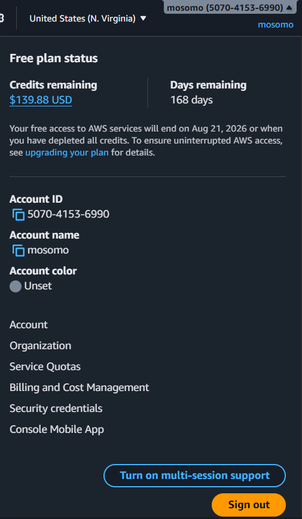 | AWS Console — logged in with account name visible |
| 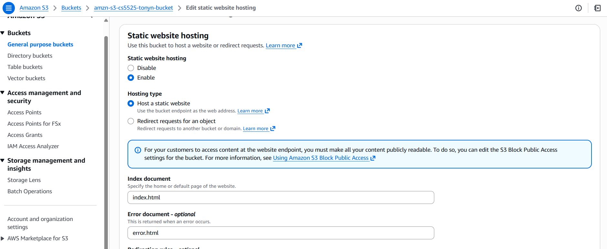 | S3 bucket created and Static Website Hosting enabled |
| 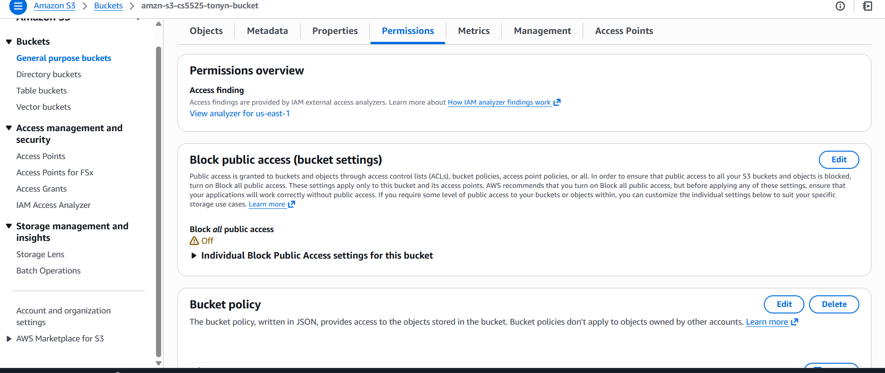 | Bucket Policy configured for public access |
| 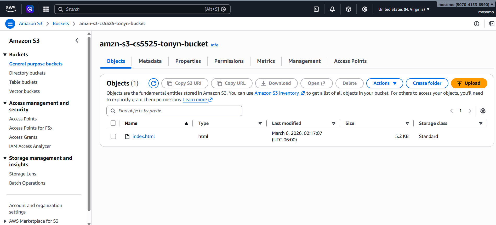 | `index.html` uploaded and listed in Objects tab |
| 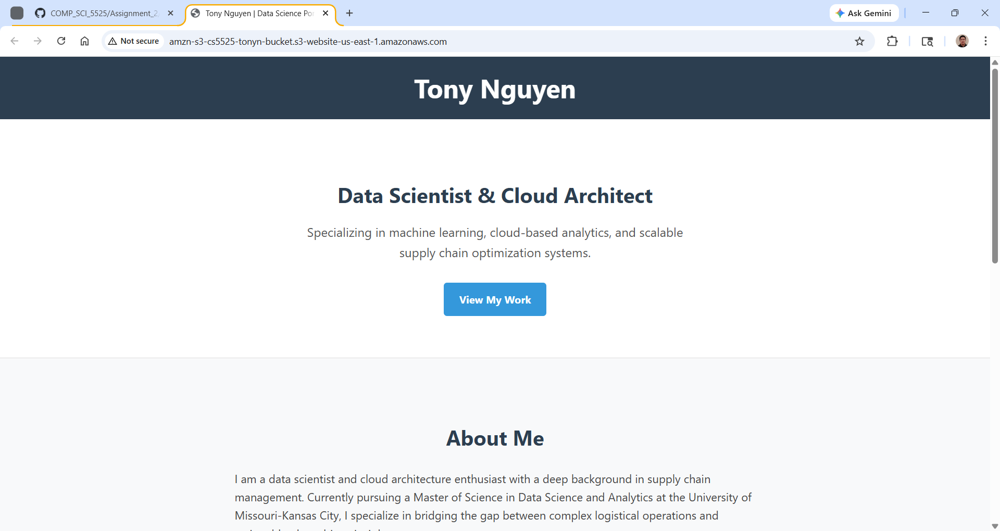 | Live site accessible at S3 endpoint |

---

### 2. Google Cloud Platform (30%)

**Method:** Compute Engine VM with Apache2 HTTP Server *(IaaS)*

#### Steps Taken

1. Signed into the **Google Cloud Console** at `console.cloud.google.com`
2. Created a new project: `cs5525-tonyn`
3. Navigated to **Compute Engine** → **VM Instances** → Created a new VM:
   - **Machine type:** `e2-micro` (free tier eligible)
   - **Boot disk:** Ubuntu 22.04 LTS
   - **Firewall:** Checked *Allow HTTP traffic* and *Allow HTTPS traffic*
4. SSH'd into the VM using the **Cloud Shell SSH** button
5. Installed and started Apache2 web server:
   ```bash
   sudo apt update && sudo apt upgrade -y
   sudo apt install apache2 -y
   sudo systemctl start apache2
   sudo systemctl enable apache2
   ```
6. Verified Apache default page via the external IP
7. Transferred the `index.html` content to the web root:
   ```bash
   sudo nano /var/www/html/index.html
   # Pasted HTML content, saved with Ctrl+O, exited with Ctrl+X
   ```
8. Confirmed the live page at `http://34.66.74.246`

#### Screenshots

| Step | Description |
|------|-------------|
| 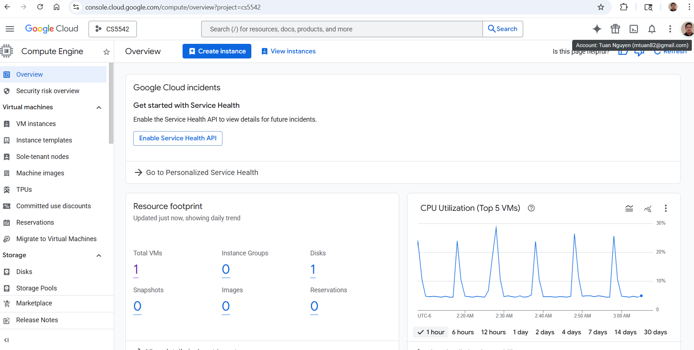 | GCP Console — logged in with account email visible |
| 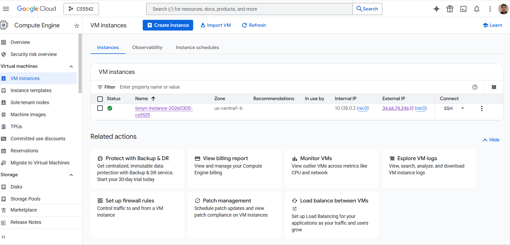 | Compute Engine VM instance running (external IP shown) |
|  | SSH terminal — Apache2 installation and systemctl output |
| 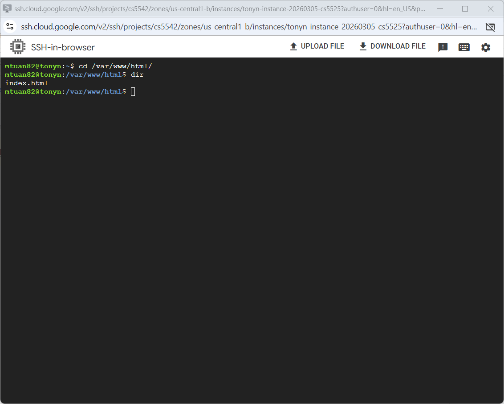 | SSH terminal — writing `index.html` to `/var/www/html/` |
| 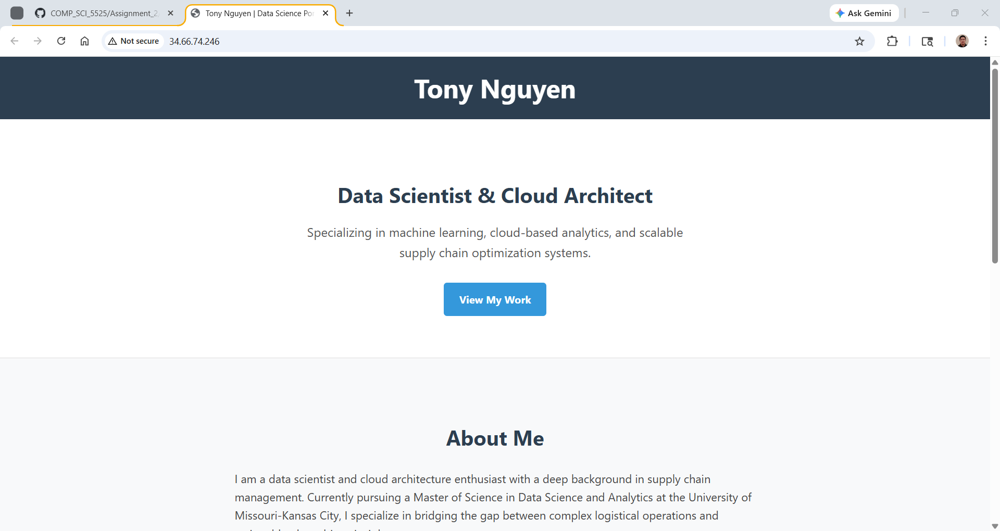 | Live site accessible at GCP external IP |

---

### 3. Microsoft Azure (30%)

**Method:** Azure Blob Storage Static Website *(PaaS)*

#### Steps Taken

1. Signed into the **Azure Portal** at `portal.azure.com`
2. Created a **Storage Account**: `cs5525tonynstorage`
   - **Region:** East US
   - **Performance:** Standard
   - **Redundancy:** LRS (Locally Redundant Storage)
3. Navigated to **Data management** → **Static website**
4. Enabled static website hosting and configured:
   - **Index document name:** `index.html`
   - **Error document path:** `404.html`
5. Noted the auto-generated primary endpoint URL
6. Navigated to the auto-created **`$web`** container
7. Uploaded `index.html` via the **Upload** button in the container view
8. Verified the live site at the Azure static website endpoint

#### Screenshots

| Step | Description |
|------|-------------|
|  | Azure Portal — logged in with account name visible |
|  | Storage account `cs5525tonynstorage` created |
|  | Static website feature enabled with index document set |
| 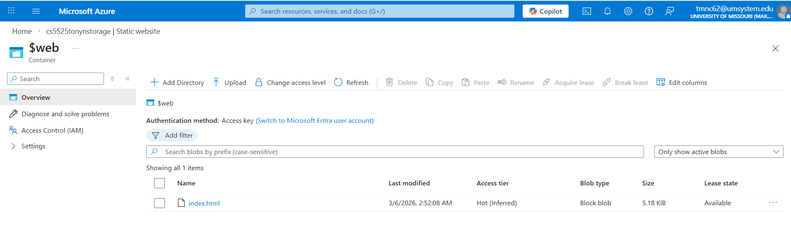 | `index.html` uploaded to the `$web` container |
| 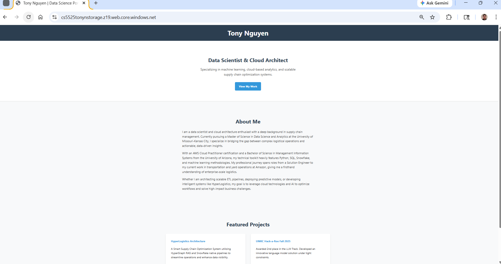 | Live site accessible at Azure endpoint |

---

## 📊 Platform Comparison

| Feature | AWS S3 | GCP Compute Engine | Azure Blob Storage |
|---------|--------|--------------------|--------------------|
| **Deployment Type** | PaaS (Managed) | IaaS (Virtual Machine) | PaaS (Managed) |
| **Setup Complexity** | ⭐ Low | ⭐⭐⭐ High | ⭐ Low |
| **Server Management** | None required | Full (Apache2) | None required |
| **HTTPS Support** | Via CloudFront CDN | Manual cert installation | Built-in ✅ |
| **Free Tier** | 5 GB storage / 20K requests | 1× e2-micro VM/month | 5 GB storage / month |
| **Deployment Speed** | ~5 minutes | ~20 minutes | ~5 minutes |
| **File Transfer Method** | S3 Console / AWS CLI | SCP / SSH / Cloud Shell | Azure Portal / Storage Explorer |
| **IAM / Access Config** | Bucket Policy (JSON) | Firewall Rules + IAM Roles | Blob access level + RBAC |
| **Custom Domain** | Via Route 53 | Via DNS A record | Via Azure CDN |

---

## 📝 Epilog

Deploying a simple personal website across AWS, Google Cloud Platform (GCP), and Microsoft Azure was an eye-opening journey revealing both the similarities and differences among those three giant web hosting providers.

AWS S3 and Azure Blob Storage stood out for their simplicity in hosting static websites. I was able to enable static website hosting with a few clicks and set the appropriate bucket or container policies to make my site publicly accessible. The process was straightforward, and I had a live URL up and running in no time. AWS S3, in particular, was enjoyable due to its simplicity and the clean, easy-to-remember endpoint URL it provided.

GCP, on the other hand, took a more hands-on approach. I had to provision a Compute Engine VM and manually install and configure Apache2. This method was the most time-consuming but also the most educational. It gave me a deeper understanding of how web servers operate at the infrastructure level. I learned how to set up the server and how to configure the web server software.

The most challenging aspect across all three platforms was managing IAM policies, bucket permissions, and firewall rules. A misconfigured firewall rule on GCP initially blocked all HTTP traffic until I explicitly opened port 80 in the VPC firewall settings. For example, AWS’s default "Block Public Access" setting required careful policy overrides to serve content publicly. These experiences underscored the importance of meticulous configuration management.

In my own reflection, I believe future classes should include a dedicated session on cloud networking fundamentals, such as VPCs, security groups, and firewall rules. A solid understanding of these concepts upfront would have significantly reduced the troubleshooting time I spent across all three deployments. Further, an initial exposure to infrastructure-as-code tools like Terraform could help standardize and automate multi-cloud workflows. It would enhance the process both the efficiency and the reduction of errors.

---

## 🛠️ Technologies Used

- **HTML / CSS** — Static personal portfolio web page
- **Amazon S3** — Object storage with static website hosting (AWS)
- **Google Compute Engine** — Ubuntu 22.04 LTS virtual machine (GCP)
- **Apache2** — HTTP web server installed on GCP VM
- **Azure Blob Storage** — Object storage with static website hosting (Azure)
- **Google Cloud Shell / SSH** — Remote VM access and file transfer
- **AWS Management Console** — S3 bucket creation and management
- **Azure Portal** — Storage account and container management

---

## 📂 Repository Structure

```
Assignment_2/
├── index.html              # Web page deployed to all three platforms
├── readme.md               # This file
└── images/
    ├── aws/
    │   ├── 01_aws_console_login.png
    │   ├── 02_s3_bucket_static_hosting.png
    │   ├── 03_bucket_policy.png
    │   ├── 04_file_upload.png
    │   └── 05_live_site.png
    ├── gcp/
    │   ├── 01_gcp_console_login.png
    │   ├── 02_vm_instance_running.png
    │   ├── 03_ssh_apache_install.png
    │   ├── 04_file_transfer_webroot.png
    │   └── 05_live_site.png
    └── azure/
        ├── 01_azure_portal_login.png
        ├── 02_storage_account_created.png
        ├── 03_static_website_enabled.png
        ├── 04_file_upload_web_container.png
        └── 05_live_site.png
```

---

## 👤 Author

**Tony Nguyen**
Master of Science in Data Science and Analytics
University of Missouri – Kansas City
CS 5525 — Cloud Computing | Spring 2026
