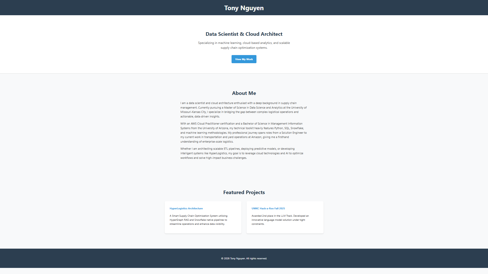
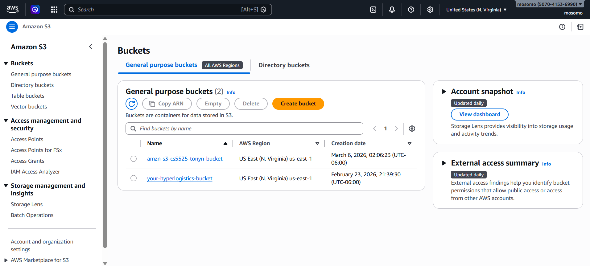
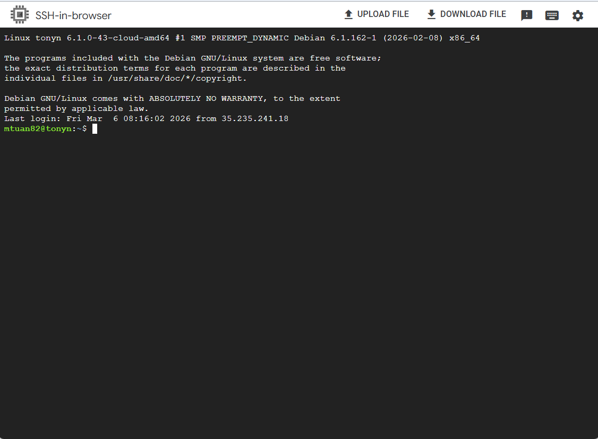
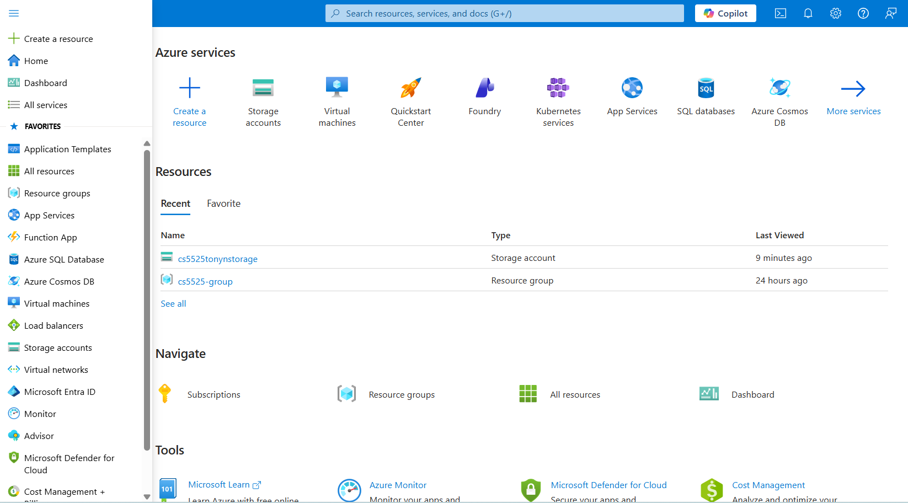
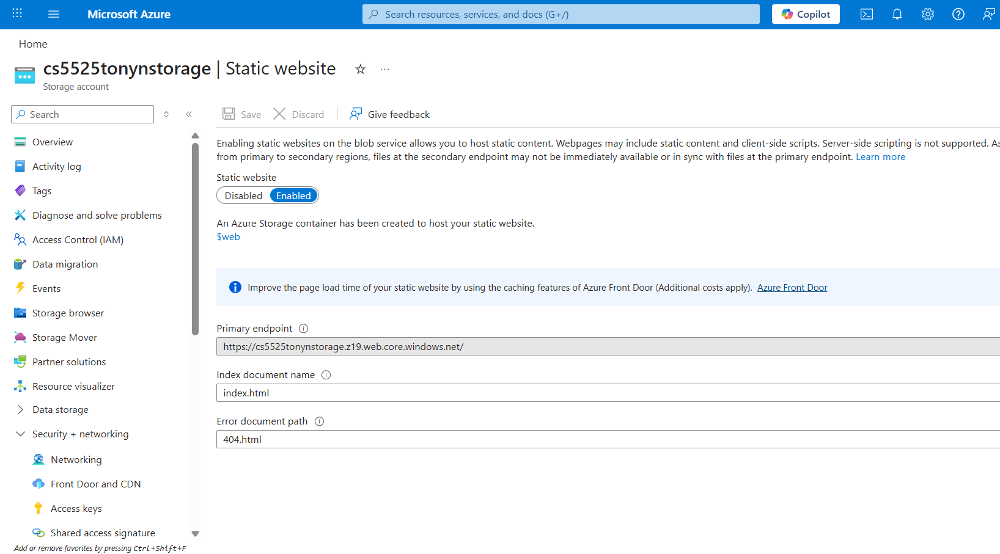

# Cloud Platform Deployment Assignment
**Name:** Tony Nguyen  
**Course:** CS5525 Cloud Computing  
**Date:** March 2026

---

## Step 1 & 2: Account Creation and Page Preparation
I successfully established active accounts on Amazon Web Services, Google Cloud Platform, and Microsoft Azure. For the web content, I developed a standardized `index.html` file using VS Code, ensuring a consistent baseline for testing deployment across all three providers.

---

## Step 3.1: Amazon Web Services (AWS)
### 1. Portal Access

### 2. Deployment Method
I utilized an **Amazon S3 Bucket** configured for **Static Website Hosting**. This managed service approach abstracts the server layer, allowing for high availability with minimal configuration.

### 3. Execution & Transfer
I uploaded the `index.html` file via the AWS Management Console and configured the Bucket Policy to allow public read access.

---

## Step 3.2: Google Cloud Platform (GCP)
### 1. Portal Access

### 2. Deployment Method
For GCP, I deployed a **Compute Engine VM Instance** (Infrastructure as a Service). This required manual environment setup, including the installation of a web server.

### 3. Execution & Transfer
After establishing an SSH connection, I installed **Apache2**, transferred the web content to the `/var/www/html/` directory, and updated the VPC firewall rules to allow HTTP traffic on port 80.

---

## Step 3.3: Microsoft Azure
### 1. Portal Access

### 2. Deployment Method
I leveraged **Azure Storage Accounts** with the **Static Website** feature enabled. Similar to the AWS approach, this utilized Blob storage to serve content directly.

### 3. Execution & Transfer
I uploaded the file to the `$web` container using the Azure Portal. The platform automatically generated a primary endpoint for public access.

---

## Deployment Summary

| Platform | URL | Status |
| :--- | :--- | :--- |
| **Amazon AWS** | `amzn-s3-cs5525-tonyn-bucket.s3-website-us-east-1.amazonaws.com` | ✅ Online |
| **Google Cloud Platform** | `http://34.66.74.246` | ✅ Online |
| **Microsoft Azure** | `cs5525tonynstorage.z19.web.core.windows.net` | ✅ Online |

---

## Step 4: Epilog

Deploying a personal web page across AWS, GCP, and Azure provided a practical demonstration of cloud service abstractions. The primary lesson learned is that the choice of service—ranging from fully managed storage buckets (AWS S3, Azure Storage) to infrastructure-as-a-service (GCP Compute Engine)—dictates the operational overhead. AWS S3 and Azure Storage were highly efficient; enabling static website hosting required only a few configuration steps and immediate URL generation. Conversely, the GCP Compute Engine deployment was more demanding, requiring SSH access, Apache installation, and manual directory management, which offered a deeper look into server-side fundamentals. 

The most significant challenge across all three platforms was navigating the nuances of Identity and Access Management (IAM) and firewall rules, where a single restrictive policy often led to 403 or timeout errors. While I found AWS S3 the most intuitive for rapid deployment, I appreciated the hands-on nature of the GCP VM approach. For future coursework, I believe a dedicated session on cloud networking fundamentals—specifically VPCs, security groups, and routing—would be invaluable for troubleshooting these cross-platform inconsistencies. Moving forward, I am interested in exploring how infrastructure-as-code (IaC) tools like Terraform could standardize these deployments across providers.
