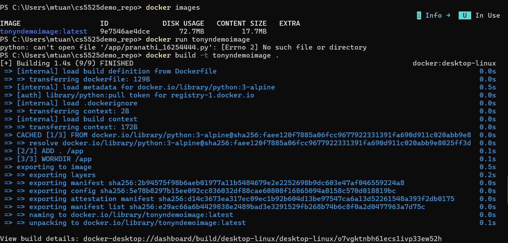
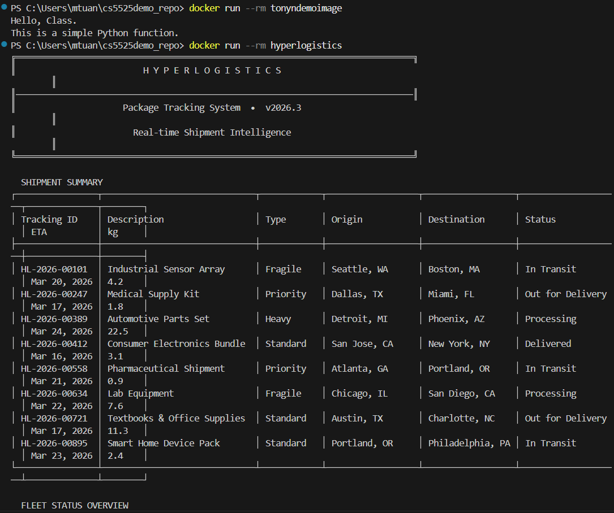
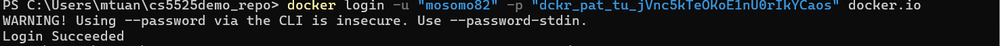
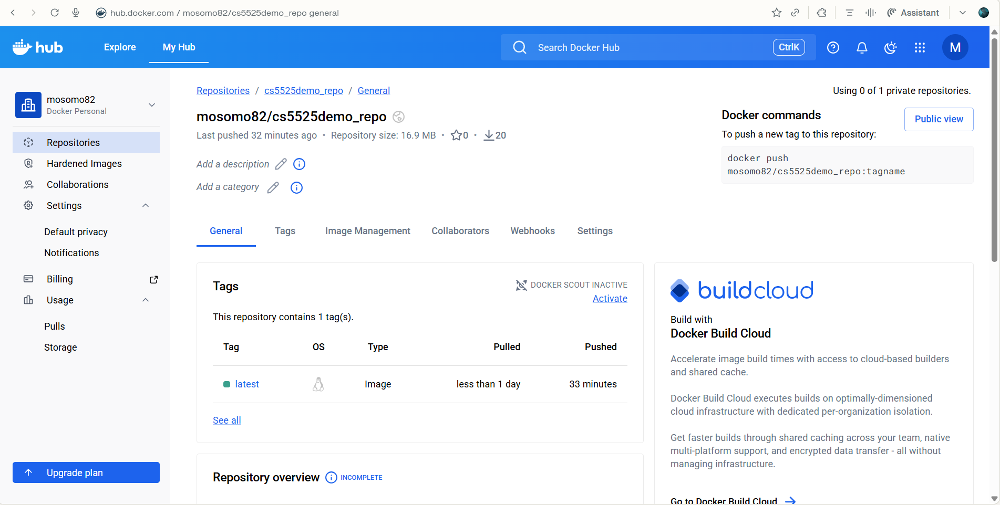
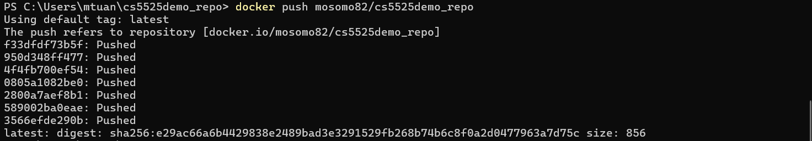
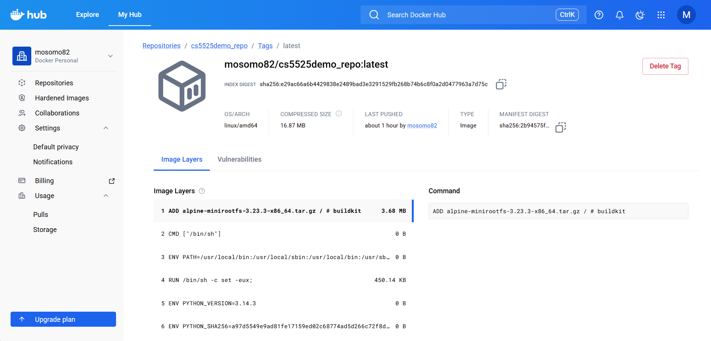

# CS5525 — Docker Image Demo - HyperLogistics Package Tracker  
**Student:** Tony Nguyen  
**File:** `cs5525tonyn_03162026.py`  
**Date:** 03/16/2026  

---

## Overview

A terminal-based package tracking CLI built with **Python stdlib only**, containerized with Docker and published to Docker Hub.

---

## Steps & Screenshots

### Step 1 — Build the Docker Image (image tagged with your name)

```bash
docker build -t tonyndemoimage .
```

> The image name **`tonyndemoimage`** includes your name as required.

📸 _Screenshot — Docker image build output & `docker images` listing showing your name:_



---

### Step 2 — Run the Container Locally

```bash
docker run --rm tonyndemoimage
```

📸 _Screenshot — Container running, showing the HyperLogistics banner and package table:_



---

### Step 3 — Log In to Your Docker Hub Account

```bash
docker login
```

> Use **your own Docker Hub account** (username must match your name).  

📸 _Screenshot — Docker Hub login success in terminal, showing your username:_



---

### Step 4 — Tag the Image for Docker Hub (with your name)

```bash
docker tag tonyndemoimage mosmo82/cs5525demo_repo
```

Replace `<your-dockerhub-username>` with your actual Docker Hub username (e.g., `mosomo82`).

📸 _Screenshot — `docker images` output showing the tagged image with your Docker Hub username:_



---

### Step 5 — Push to Docker Hub

```bash
docker push mosomo82/cs5525demo_repo
```

📸 _Screenshot — Push output in terminal confirming layers uploaded:_



---

### Step 6 — Verify Image on Docker Hub Website

Navigate to `https://hub.docker.com/repository/docker/mosomo82/cs5525demo_repo` and confirm:
- Repository is public
- Your Docker Hub **account name** is visible
- Image tag `latest` is listed

📸 _Screenshot — Docker Hub web page showing your account name and the repository:_



---

## Quick Reference — All Commands

```bash
# 1. Build
docker build -t tonyndemoimage .

# 2. Run locally
docker run --rm tonyndemoimage

# 3. Login to YOUR Docker Hub account
docker login

# 4. Tag
docker tag tonyndemoimage mosmo82/cs5525demo_repo

# 5. Push
docker push mosmo82/cs5525demo_rep
```

---

## Project Structure

```
cs5525demo_repo/
├── cs5525tonyn_03162026.py   # Main Python CLI application
├── Dockerfile                 # Container definition (python:3-alpine, no pip)
└── README.md                  # This file
```

---

## Technical Notes

- **Base image:** `python:3-alpine` (no additional packages installed)
- **Dependencies:** Python stdlib only — `datetime`, `sys`, `os`
- **Non-interactive safe:** TTY detection (`sys.stdin.isatty()`) ensures the app exits cleanly in Docker without waiting for input
- **Reproducible output:** All 8 package records are hardcoded (no `random`), so output is identical every run

---

